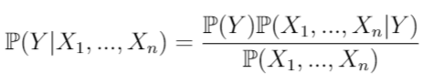
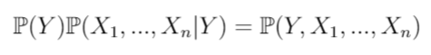
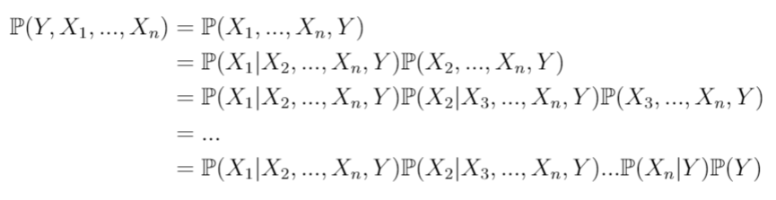
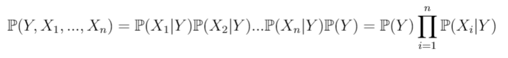
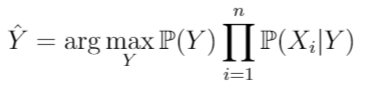

## Categorical Naive Bayes

<!-- TABLE OF CONTENTS -->
<details open="open">
  <summary>Table of Contents:</summary>
  <ol>
    <li><a href="#About">About</a></li>
    <li><a href="#Mathematical%20model">Mathematical model</a></li>
    <li><a href="#Example">Example</a></li>
  </ol>
</details>


## About
The script contains implementation of the Naive Bayes algorithm for categorical variables that do not require coding. The algorithm can be used both for the binary classification problem and for multiclass classification.

## Mathematical model
Let's assume that we have $n$ independent variables ($X_1, X_2, ..., X_n$) and target $Y$. Bayes' theorem states the following relationship
<br>

<br>
In practice, only the numerator of the fraction is interesting, because the denominator does not depend on $Y$, and the values of $X_i$ are given. The denominator is therefore constant. The numerator of the fraction is equivalent to the cumulative probability model
<br>

<br>
Using the chain rule for conditional probability we have
<br>

<br>
Now, using the assumption of conditional independence of the predictors, we can present the model as follows
<br>

<br>
Since we want to predict the class of the $Y$ variable, it is only interesting for which value of the dependent variable is the highest probability, so we can omit the constant appearing in the denominator. Then the predicted class is
<br>

<br>

## Example
```r
# Clean Environment
remove(list=ls())

# Load R script with categoricalNB
source('categoricalNB.R')

# Read the data
data <- read.csv("data\\agaricus-lepiota.csv", header = TRUE)

# Train-test split
test_indx <- sample(1:dim(data)[1], round(dim(data)[1]/3))
y_train <- data$target[-test_indx]
y_test <- data$target[test_indx]
X_train <- data[-test_indx, -1]
X_test <- data[test_indx, -1]

# Create Naive Bayes model
NBmodel <- naive_bayes(X_data = X_train, y_data = y_train, lambda = 0)

# Predictions on test data
preds <- predict.nb(X_data = X_test, model = NBmodel)

# Accuracy evaluation
cat('ACCURACY\n',
'TRAIN:',sum(NBmodel$preds == as.character(y_train))/length(y_train),
'\n  TEST:',sum(preds == as.character(y_test))/length(y_test)
)
```
